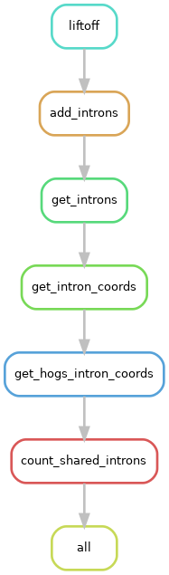

##Verify intron coordinates

The purpose of this snakemake pipeline is to discover how many introns are shared (i.e., same start and end coordinates) between Race 5 and Race 4. To find this out, the pipeline uses [Liftoff](https://github.com/agshumate/Liftoff) map the gene annotations from C. fulvum Race 4 to the genome of Race 5. Intron features are added to the GFF files (output of Liftoff and Race 5) with `agat_sp_add_introns.pl` from [AGAT](https://github.com/NBISweden/AGAT). Intron coordinates are extracted and compared with the R script `scripts/count_shared_introns.R`, which counts how many introns have the same coordinates between orthologous genes.

Required files in `data/`:

- `data/PB655_02_combined_filt.gff`: annotation of Race 4 genome
- `data/PB655_02_Race4.bp.p_ctg_sorted_edited.fasta`: genome of Race 4
- `data/GCA_020509005.2_Cfulv_R5_v5_genomic.fasta`: Race 5 genome
- `data/R5.gff`: Race 5 genome annotation
- `data/pairs_hogs.txt`: pairs of orthologous genes identified with OrthoFinder

Note: Because I was having problem mapping the genome annotation of Race 4 to Race 5 genome, it was a good idea to process the `GFF` file with `agat_convert_sp_gxf2gxf.pl` from AGAT package. First, remove exons and CDS IDs with `sed '/\texon\t/ s/ID=.*;Parent/Parent/g'`, and then use `agat_convert_sp_gxf2gxf.pl` to add new exons and CDS IDs.

